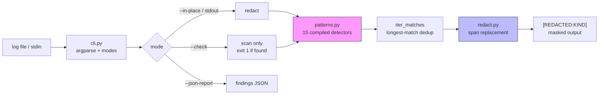

# log-redactor

Scrub leaked secrets from LLM/agent logs and CI output — before you paste them into a chat, a ticket, or a debug dump.

`log-redactor` detects ~15 kinds of leaked credentials (API keys, tokens, private keys, JWTs, `Authorization` headers, …) and rewrites them with typed masks like `[REDACTED:OPENAI_API_KEY]`, so logs stay readable and shareable. It works offline with zero API keys, and ships a `--check` mode that fails CI when a secret slips into build output.

```bash
$ log-redactor examples/agent.log | head -8
[2026-09-28T16:58:02Z] INFO  agent.runtime: starting run id=run_9f31 (model=gpt-4o)
[2026-09-28T16:58:04Z] INFO  agent.llm: provider=openai key=[REDACTED:OPENAI_API_KEY]
[2026-09-28T16:58:11Z] WARN  agent.s3: using access key [REDACTED:AWS_ACCESS_KEY_ID] for bucket agent-checkpoints
[2026-09-28T16:58:15Z] INFO  agent.auth: service token [REDACTED:JWT] issued
[2026-09-28T16:58:16Z] DEBUG agent.http: Authorization: Bearer [REDACTED:BEARER_TOKEN]
```

## Why this exists

LLM agents print *everything*: tool arguments, HTTP headers, environment dumps. A single `Authorization: Bearer …` line in a pasted debug log is a live credential leak. Existing scanners (gitleaks, trufflehog) target repos; `log-redactor` targets the artifact agent developers actually share — the log stream — and redacts in place with masks that keep the log's structure readable.

## Install

```bash
git clone https://github.com/sulaimanvesal/log-redactor.git
cd log-redactor
pip install -r requirements.txt   # pytest only; the tool itself has no runtime deps
```

No API keys, no network access, no config files.

## Usage

```bash
# Redact a log file to stdout
log-redactor agent.log

# Redact several files in place
log-redactor --in-place agent.log debug.log

# Pipe an agent's stderr through it live
my-agent run 2>&1 | log-redactor

# CI gate: exit 1 if any secret is present (prints nothing redacted)
log-redactor --check build.log

# JSON findings report (to stderr, or stdout in --check mode)
log-redactor --json-report agent.log > clean.log 2> report.json

# Custom mask template
log-redactor --mask '***{kind}***' agent.log
```

As a library:

```python
from logredact import redact, scan

clean, findings = redact(raw_log)
for f in findings:
    print(f.kind, f.line, f.column, f.preview)  # preview never contains the secret
```

## Architecture



### Detected secret kinds

| Kind | Example shape |
|---|---|
| `AWS_ACCESS_KEY_ID` | `AKIA…` (20 chars) |
| `AWS_SECRET_ACCESS_KEY` | `aws_secret_access_key = …` (40 chars) |
| `GITHUB_TOKEN` | `ghp_…`, `github_pat_…` |
| `OPENAI_API_KEY` | `sk-…`, `sk-proj-…` |
| `ANTHROPIC_API_KEY` | `sk-ant-…` |
| `STRIPE_KEY` | `sk_live_…`, `rk_test_…` |
| `SLACK_TOKEN` | `xoxb-…`, `xoxp-…` |
| `GOOGLE_API_KEY` | `AIza…` (39 chars) |
| `DISCORD_WEBHOOK` | `discord.com/api/webhooks/…` |
| `NPM_TOKEN` | `npm_…` |
| `PRIVATE_KEY` | `-----BEGIN … PRIVATE KEY-----` |
| `JWT` | `eyJ….eyJ….…` |
| `BEARER_TOKEN` / `BASIC_AUTH` | `Authorization: Bearer …` |
| `GENERIC_ASSIGNMENT` | `api_key = "…"`, `client_secret: …` |

Prefix-preserving detectors (e.g. `Bearer`, `api_key =`) keep the label and redact only the secret value, so `Authorization: Bearer [REDACTED:BEARER_TOKEN]` still tells you *what* was redacted. Overlaps resolve to the longest match.

## Demo

```bash
python demo.py
```

Redacts `examples/agent.log` (a synthetic agent trace whose credentials are fake and inert), prints before/after plus a JSON findings report, and asserts the redacted output contains zero detectable secrets.

## Tests

```bash
pytest tests/ -q   # 20 tests: patterns, engine, CLI
```

## Design notes

- **No false-confidence masking.** Findings carry line/column/length and a 4-char preview — never the secret — so reports are safe to share.
- **Deterministic.** Patterns are ordered most-specific → most-generic; overlapping matches dedup to the longest span.
- **`--check` prints nothing redacted** by design: CI logs must never echo the secret back.
- Detection is heuristic, not a guarantee — pair with real secret rotation if a leak is suspected.

## License

MIT — see [LICENSE](LICENSE).
